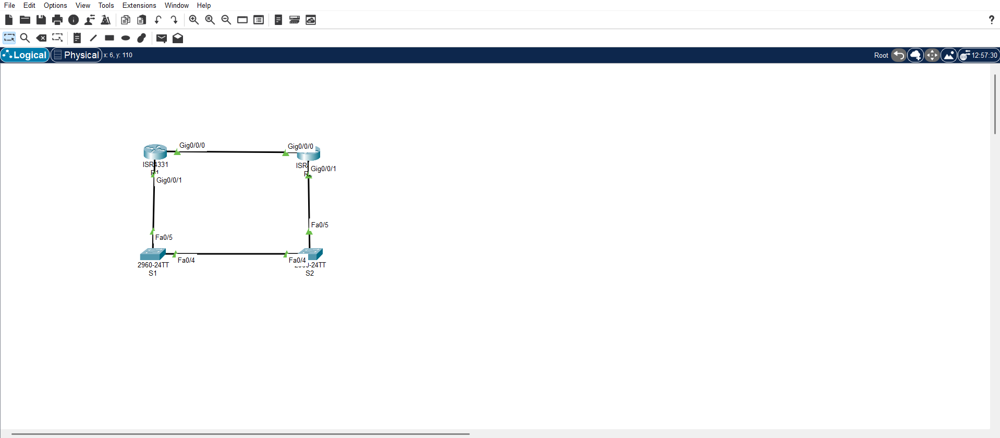

# CCNA Static Routing Lab

**Cisco Packet Tracer lab:** Static, Default & Floating Static Routing for **IPv4** and **IPv6**.  
This project is part of my CCNA practice.

<p align="center">
  
</p>

## 🔧 Files
- [CCNA Static Routing Lab.pkt](./CCNA%20Static%20Routing%20Lab.pkt) — Packet Tracer project
- `R1-config.txt` • `R2-config.txt` — saved running-configs
- `R1-show-ip-route.txt` • `R1-traceroute.txt` • `R2-show-ipv6-route.txt` — verification outputs
- `topology.png` — topology screenshot

## 🎯 Objectives
1. Configure IPv4/IPv6 addressing on routers.
2. Add static routes to remote networks.
3. Add default routes (IPv4/IPv6).
4. Implement **floating static** default route (higher AD) for failover.
5. Verify with `ping`, `traceroute`, `show ip route` / `show ipv6 route`.

## ▶️ How to open
1. Download the **.pkt** file and open it in Packet Tracer (8.x+ recommended).
2. Power on devices; check interfaces are **up**.
3. Use the commands in the sections below to verify routing and failover.

## 🧩 Key Commands (examples)

### IPv4 (R1 side)
```bash
# Static route to R2 Loopback1 via R2 G0/0/1
ip route 10.2.0.0 255.255.255.0 192.168.1.2

# Default route via R2 G0/0/0
ip route 0.0.0.0 0.0.0.0 172.16.1.2

# Floating static default route (AD 80) via R2 G0/0/1
ip route 0.0.0.0 0.0.0.0 192.168.1.2 80
